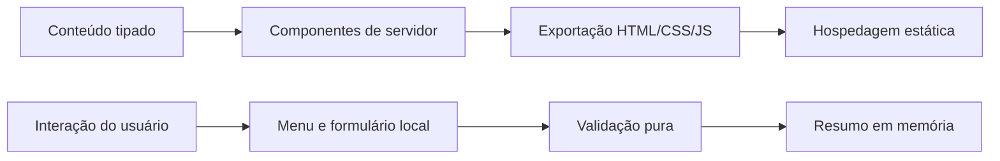

# Arquitetura

## Visão geral

A maior parte da página é renderizada por componentes de servidor. Apenas `Header` e `QuoteRequest` são componentes de cliente, pois precisam manter estado de interface. Não existe camada de API, banco de dados ou integração de terceiros.

## Fronteiras

- `src/app`: composição da página, metadados e rotas técnicas;
- `src/components`: blocos de interface reutilizáveis;
- `src/components/sections`: seções editoriais da landing page;
- `src/content`: conteúdo de negócio e configuração pública tipados;
- `src/lib`: regras puras, independentes da interface;
- `src/styles`: tokens e estilos globais;
- `tests/e2e`: fluxos reais em navegadores desktop e móvel.

O conteúdo fica separado da apresentação para permitir adaptar serviços e textos sem reescrever a estrutura. As regras do simulador ficam em funções puras para facilitar teste e futura substituição por uma integração real.

## Fluxo do formulário

1. O usuário preenche campos opcionais e fictícios.
2. O navegador valida limites e opções permitidas.
3. Um resumo textual é mantido apenas no estado React.
4. O usuário pode copiar o texto por ação explícita.
5. Recarregar a página elimina todas as informações.

Os campos não possuem atributo `name`, o envio padrão é cancelado e o projeto não declara endpoint. Testes de navegador verificam que a ação não gera requisições não-GET.

## Decisões não tomadas

- **Supabase:** desnecessário porque não há dado legítimo a persistir.
- **API própria:** adicionaria custo, superfície de ataque e manutenção sem valor demonstrativo.
- **biblioteca de componentes:** a interface é pequena e usa elementos nativos; uma dependência seria desproporcional.
- **analytics:** omitido para manter privacidade e zero scripts de terceiros.
- **LocalBusiness JSON-LD:** omitido porque a empresa é fictícia e não deve parecer uma organização operacional.

## Implantação e reversão

`next build` gera a pasta estática `out`. A hospedagem recomendada é Cloudflare Pages com preview por commit. Uma reversão restaura a implantação estática anterior; mudanças de conteúdo não exigem migração de dados.
